# Ness Network Image Ecosystem

This diagram illustrates the 16 Docker images available in the `nessnetwork` namespace and how they relate to each other.

## Image Hierarchy & Relationships

```mermaid
graph TD
    %% Styles
    classDef core fill:#f96,stroke:#333,stroke-width:2px;
    classDef network fill:#61dafb,stroke:#333,stroke-width:2px;
    classDef app fill:#a8d5ff,stroke:#333,stroke-width:2px;
    classDef tools fill:#b7eb8f,stroke:#333,stroke-width:2px;
    classDef unified fill:#ff7875,stroke:#333,stroke-width:4px,color:white;

    subgraph "Unified Appliance (For Umbrel)"
        Unified["📦 ness-unified<br/>(Runs EVERYTHING)"]:::unified
    end

    subgraph "Core Infrastructure"
        Emer["💎 emercoin-core<br/>(Blockchain + Identity)"]:::core
        Ygg["🕸️ yggdrasil<br/>(Mesh Network)"]:::core
    end

    subgraph "Network & Privacy Layer"
        DNS["🌐 dns-reverse-proxy<br/>(Decentralized DNS)"]:::network
        Sky["☁️ skywire<br/>(VPN/Mesh)"]:::network
        I2P["🧅 i2p-yggdrasil<br/>(Anonymity Layer)"]:::network
        AWG["🛡️ amneziawg<br/>(Stealth VPN)"]:::network
        SkyAWG["🔗 skywire-amneziawg<br/>(VPN + Mesh)"]:::network
        AmneziaExit["🚪 amnezia-exit<br/>(Exit Node)"]:::network
    end

    subgraph "Applications"
        Priv["👁️ privateness<br/>(Core App)"]:::app
        NessChain["⛓️ ness-blockchain<br/>(Native Chain)"]:::app
        IPFS["📦 ipfs<br/>(Storage)"]:::app
    end

    subgraph "Entropy & Tools (Security)"
        PyUHEP["🎲 pyuheprng<br/>(Entropy Source)"]:::tools
        PrivTools["🛠️ privatenesstools<br/>(Utilities)"]:::tools
        PrivNumer["🔢 privatenumer<br/>(Number Gen)"]:::tools
        PyTools["📦 pyuheprng-privatenesstools<br/>(Combined Tools)"]:::tools
    end

    %% Relationships
    Emer -->|Identity/DNS| DNS
    Emer -->|Identity| Priv
    Emer -->|Entropy| PyUHEP
    
    Ygg -->|Routing| Priv
    Ygg -->|Routing| I2P
    
    DNS -->|Resolution| Priv
    
    PyUHEP -->|Randomness| Priv
    PyUHEP -->|Randomness| PrivNumer

    %% Unified includes everything
    Unified -.->|Contains| Emer
    Unified -.->|Contains| Ygg
    Unified -.->|Contains| Sky
    Unified -.->|Contains| Priv
    Unified -.->|Contains| DNS
```

## Image Categories

### 1. 📦 Unified Appliance

* **`ness-unified`**: The "Fat Container". Perfect for **Umbrel** or single-slot deployments. It runs Emercoin, Yggdrasil, Skywire, Privateness, and DNS all in one place using Supervisor.

### 2. 💎 Core Infrastructure

Foundation services that other apps depend on.

* **`emercoin-core`**: The source of truth for identities and DNS.
* **`yggdrasil`**: The IPv6 mesh network layer.

### 3. 🌐 Network & Privacy

Services that handle routing, VPNs, and anonymity.

* **`dns-reverse-proxy`**: Resolves `.lib`, `.coin`, `.emc` domains locally.
* **`skywire`**, **`amneziawg`**, **`i2p-yggdrasil`**: Different layers of encrypted transport.

### 4. 👁️ Applications

User-facing services.

* **`privateness`**: The main dashboard and application logic.
* **`ipfs`**: Decentralized storage.

### 5. 🛠️ Security Tools (Entropy)

Specialized services ensuring cryptographic strength.

* **`pyuheprng`**: Feeds true hardware entropy to the system.
